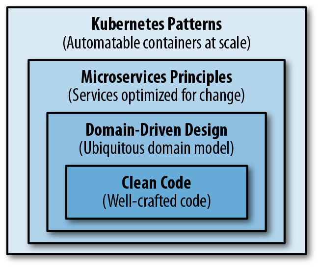

# Introduction

## The path to cloud native

The skills required to write a good cloud-native app.

## Distributed primitives

Compare to in-process primitives(local primitives), K8S distributed primites have commonalities, but they are not directly comparable and replaceable.

### Container

### Pods

### Services

### Labels

### Anotations

### Namespaces

